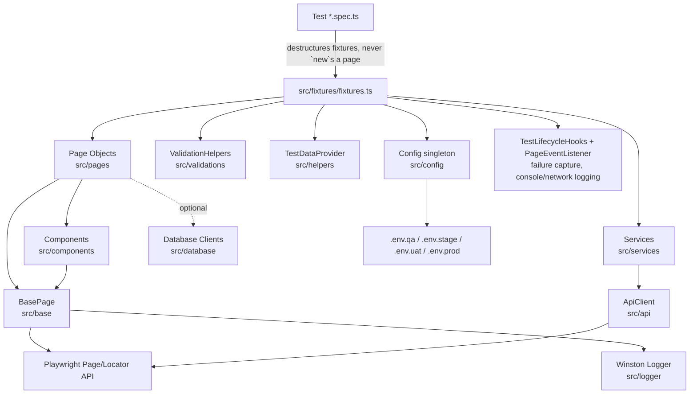

# QE Automation Framework

An enterprise-grade, TypeScript Playwright Test framework: Page Object Model + Component Object Model,
dependency-injected fixtures, environment-driven config, Winston logging, Allure/HTML reporting, and an
optional multi-database layer - built to scale to thousands of tests across parallel workers and CI.

## Architecture



**Rule of thumb**: tests only do Arrange/Act/Assert with fixtures; page objects only do locators + actions +
navigation; components wrap one reusable UI pattern; assertions live in `ValidationHelpers` or `expect(...)`
in the test itself - never inside a page object.

## Folder Structure

```
src/
  base/          BasePage - every Playwright action (click, fill, wait*, etc.), no assertions
  pages/         Page Objects (LoginPage, DashboardPage, DemoPage, WeSendCVPage)
  components/    Component Object Model (HeaderComponent, NavigationMenu, TableComponent, Pagination,
                 ToastMessage, CommonDialog) - reused across pages instead of duplicated
  locators/      LocatorFactory (accessible-locator helpers) + CommonLocators (shared cross-page selectors)
  fixtures/      Dependency-injected Playwright fixtures - the only way tests get pages/services
  utils/         Stateless utility classes (Date/File/Json/CSV/Excel/Zip/Encryption/Network/Storage/...)
  helpers/       Test-context helpers (TestDataProvider, RetryHelper, ReportAttachmentHelper)
  constants/     Timeouts, Routes, Messages, Roles, EnvKeys, FilePaths, ReportNames
  config/        Config singleton - typed, env-driven getters; never hardcode URLs/creds/timeouts
  enums/         BrowserType, UserRole, Environment, Status, Country, Language, DatabaseType, ...
  interfaces/    IConfig and other cross-cutting contracts
  models/        Domain types (User, Job, ApiResponse)
  services/      Business/API service layer (AuthService, JobService) wrapping ApiClient
  api/           ApiClient - GET/POST/PUT/PATCH/DELETE + status/JSON assertions
  database/      Optional multi-DB layer (Postgres/MySQL/MsSql/Oracle) via Factory pattern
  hooks/         GlobalSetup/GlobalTeardown, TestLifecycleHooks (failure-only capture)
  listeners/     CustomReporter (execution summary), PageEventListener (console/network logging)
  logger/        Winston logger - daily rotating file + error file + console (dev only)
  validations/   ValidationHelpers - the only place assertions belong
  builders/      Builder Pattern test data (UserBuilder, JobBuilder)
  testdata/      Static/JSON/CSV test data, keyed by domain (urls, apiEndpoints, users, payloads)
  exceptions/    Typed errors (ConfigurationError, ElementError, APIError, DatabaseError, ValidationError,
                 FrameworkError)

tests/
  smoke/ sanity/ regression/ e2e/ api/          required by spec
  accessibility/ contract-tests/ chaos-tests/    additional specialized coverage kept alongside the above
  i18n-tests/ integration-tests/ interop-tests/
  mobile/ mock-tests/ network-resilience/
  performance-tests/ resilience/ security-tests/
  unit-tests/ validation-tests/ vibe/ wesendcv/

reports/ screenshots/ videos/ traces/ logs/      generated at runtime (gitignored)
.github/workflows/                               CI
demo/                                            local target app the smoke/sanity/e2e suite runs against
```

## Getting Started

```bash
npm install
npm run install:browsers
npm test
```

`npm test` starts `tools/dev-server.js` automatically (via Playwright's `webServer`) and serves the `demo/`
app at `http://127.0.0.1:3000` - no separate setup needed for the smoke/sanity/regression/e2e suites.

## Running Tests

| Command | What it runs |
|---|---|
| `npm test` | Everything, all projects (chromium/firefox/webkit/mobile) |
| `npm run test:smoke` / `test:sanity` / `test:regression` / `test:e2e` / `test:api` | One required category |
| `npm run test:headed` / `test:debug` / `test:ui` | Debugging modes |
| `npx playwright test --project=chromium` | One browser only |
| `BROWSER=firefox npm test` | Env-driven browser selection (Strategy pattern, see `BrowserUtils.buildProjects()`) |
| `ENVIRONMENT=stage npm test` | Loads `.env.stage` via the `Config` singleton |

Environments are `.env.qa` / `.env.stage` / `.env.uat` / `.env.prod` (copy `.env.example` to add your own).
`Config` (`src/config/Config.ts`) is a Singleton exposing strongly typed getters - `Config.baseUrl`,
`Config.adminUsername`, `Config.browser`, `Config.retries`, etc. Nothing in the framework hardcodes a URL,
credential, or timeout; everything routes through `Config` or `src/constants/`.

## How To...

**Add a new page**: create `src/pages/MyPage.ts` extending `BasePage`, declare locators + actions +
navigation only (no assertions), then add a fixture for it in `src/fixtures/fixtures.ts` so tests never
`new` it directly.

**Add a new component**: create `src/components/MyComponent.ts` extending `BaseComponent`, scope it to a
root `Locator`, and compose it into whichever page(s) use it (see `DashboardPage` composing
`HeaderComponent` + `NavigationMenu` + `TableComponent` + `Pagination` + `ToastMessage` + `CommonDialog`).

**Add a new test**: put a `*.spec.ts` file in the right `tests/<category>/` folder, import
`{ test, expect }` from `src/fixtures/fixtures` (not `@playwright/test` directly), and keep the test body to
Arrange/Act/Assert - business logic belongs in the page object or a service.

**Add a new environment**: create `.env.<name>`, add the value to `Environment` (`src/enums/Environment.ts`)
if it's a brand-new tier, then run with `ENVIRONMENT=<name> npm test`.

**Add DB validation**: `src/database/DatabaseClientFactory.create(DatabaseType.POSTGRES, options)` returns an
`IDatabaseClient`. None of the four drivers (`pg`, `mysql2`, `mssql`, `oracledb`) are installed by default -
install only the one you need (e.g. `npm install pg`); the client throws a clear `DatabaseError` telling you
which package is missing if you forget.

## Parallel Execution & Cross-Browser

`fullyParallel: true` in `playwright.config.ts`; each test gets an isolated `BrowserContext` via Playwright's
built-in worker model, so there's no shared mutable state to coordinate. Projects are built by
`BrowserUtils.buildProjects()` (Strategy pattern per browser) - by default chromium/firefox/webkit + two
mobile profiles all run; set `BROWSER=<chromium|firefox|webkit>` to pin one, or `--project=<name>` at the CLI.

## Reporting & Logging

- **Playwright HTML report**: `reports/html` (`npx playwright show-report reports/html`)
- **Allure**: `npm run allure:generate && npm run allure:open` (results in `reports/allure-results`,
  environment info - browser/env/retries - written by `src/hooks/GlobalSetup.ts`)
- **JUnit/JSON**: `reports/junit.xml`, `reports/test-results.json` (CI-friendly)
- **CustomReporter** (`src/listeners/CustomReporter.ts`): structured pass/fail/skip/duration/retry summary
  logged through Winston, not stdout
- **Logs**: `logs/app-<date>.log` (info+) and `logs/error.log` (errors only), daily-named, no `console.log`
  anywhere in framework code
- **Failure capture**: `TestLifecycleHooks.captureOnFailure` (wired into the overridden `page` fixture) takes
  a screenshot and attaches the last 50 log lines to the test report automatically - only on failure

## Design Patterns Used

Page Object Model, Component Object Model, Factory (`DatabaseClientFactory`), Singleton (`Config`, `Logger`),
Builder (`UserBuilder`, `JobBuilder`), Strategy (`BrowserUtils` browser selection), Dependency Injection
(Playwright fixtures), Utility Pattern (`*Utils` static classes), Fluent API (builders' `.withX().build()`).

## Coding Standards

- No duplicated Playwright actions - everything routes through `BasePage`
- No assertions/validations/business logic in page objects - that's `ValidationHelpers` or the test itself
- No hardcoded URLs, credentials, or timeouts - use `Config` / `src/constants`
- No manual page-object instantiation in tests - use fixtures
- Prefer `getByRole` / `getByLabel` / `getByPlaceholder` / `getByText` / `getByTestId`; avoid CSS, never XPath

## CI/CD

`.github/workflows/ci.yml` runs lint → typecheck → Playwright tests → Allure report generation → artifact
upload on every push/PR, with a `workflow_dispatch` trigger to pick environment/browser manually.

## Troubleshooting

- Failing test? Check `reports/html` first - it has the screenshot/video/trace plus attached log tail.
- `npm run test:debug` or `npm run test:ui` for interactive debugging.
- Browser install issues: `npm run install:browsers`.
- AI agents/chatmodes for planning, generation, healing, and review are documented in `docs/ai-agents.md`.
