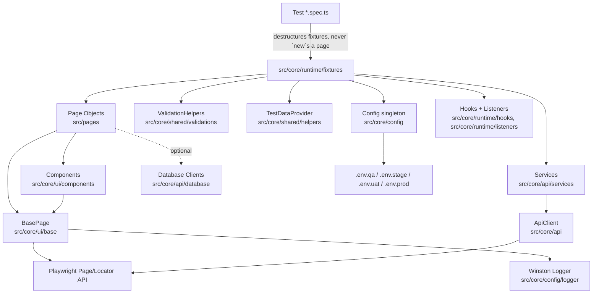

# QE Automation Framework

An enterprise-grade, TypeScript Playwright Test framework featuring:
- **Page Object Model (POM) + Component Object Model (COM)**: For maintainable, scalable UI automation
- **Dependency-Injected Fixtures**: Automatically inject pages, services, and helpers into tests
- **Environment-Driven Config**: Multi-environment support via `.env.qa`, `.env.stage`, `.env.uat`, `.env.prod`
- **Advanced Reporting**: Playwright HTML, Allure, JUnit, and custom reporting with screenshots/videos/traces on failure
- **Winston Logging**: Daily rotating logs, console output (dev only), and structured logging
- **AI-Powered Development**: 5 chatmodes (Planner, Generator, Healer, API Testing, Manual Testing) + 2
  auto-loaded skills (test debugging, code review), an MCP server for programmatic agent access, and a
  timestamped archive of every agent response (see [AI Agents, Chatmodes & Skills](#ai-agents-chatmodes--skills))

## Table of Contents
- [Architecture](#architecture)
- [Folder Structure](#folder-structure)
- [Prerequisites](#prerequisites)
- [Getting Started](#getting-started)
  - [Step 1: Install Dependencies](#step-1-install-dependencies)
  - [Step 2: Configure Environment](#step-2-configure-environment)
  - [Step 3: Install Browsers](#step-3-install-browsers)
  - [Step 4: Run Your First Tests](#step-4-run-your-first-tests)
- [Core Concepts](#core-concepts)
- [Running Tests](#running-tests)
  - [Test Categories](#test-categories)
  - [Sample Scripts](#sample-scripts-testszsamplescript)
  - [Browser & Environment Selection](#browser--environment-selection)
  - [Debugging Modes](#debugging-modes)
- [How-To Guides](#how-to-guides)
  - [How to Add a New Page Object](#how-to-add-a-new-page-object)
  - [How to Add a New Component](#how-to-add-a-new-component)
  - [How to Add a New Test](#how-to-add-a-new-test)
  - [How to Add a New Environment](#how-to-add-a-new-environment)
  - [How to Use the API Client](#how-to-use-the-api-client)
- [AI Agents, Chatmodes & Skills](#ai-agents-chatmodes--skills)
- [Reporting & Logging](#reporting--logging)
- [Coding Standards](#coding-standards)
- [CI/CD](#cicd)
- [Troubleshooting](#troubleshooting)

---

## Architecture

**Rule of Thumb**:
- Tests only: `Arrange → Act → Assert` using fixtures
- Page Objects only: Locators, Actions, Navigation
- Assertions: In tests or `ValidationHelpers`
- Components: Reusable UI patterns across pages

---

## Folder Structure
`src/pages/` sits directly under `src/` since it's what tests touch most directly. Everything else -
the framework "engine" - lives under `src/core/`, grouped by architectural role:

| Path | Contains | Purpose |
|------|---------|---------|
| `src/pages/` | `LoginPage.ts`, `DashboardPage.ts`, `DemoPage.ts`, `WeSendCVPage.ts` | Page Objects - the layer tests interact with |
| `src/core/ui/` | `base/`, `components/`, `locators/` | Everything else that touches the Playwright Page/Locator API directly |
| `src/core/api/` | `ApiClient.ts` (root), `services/`, `database/` | Backend/data I/O - API client, business services, optional multi-DB layer |
| `src/core/runtime/` | `fixtures/`, `hooks/`, `listeners/` | Test lifecycle wiring - dependency injection, setup/teardown, console/network logging |
| `src/core/data/` | `testdata/`, `builders/`, `models/`, `enums/` | Test data & domain shapes |
| `src/core/config/` | `Config.ts` (root), `constants/`, `logger/` | Environment config and cross-cutting constants/logging |
| `src/core/shared/` | `interfaces/`, `exceptions/`, `helpers/`, `utils/`, `validations/` | Cross-cutting support used across all the groups above |

| Path | Purpose |
|------|---------|
| `.github/workflows/` | CI pipeline |
| `tests/smoke/` | Critical path smoke tests |
| `tests/sanity/` | Quick sanity checks for PRs |
| `tests/regression/` | Full regression suite |
| `tests/api/` | API tests |
| `tests/e2e/` | End-to-end user flows |
| `reports/` | All generated output lives here (gitignored) |
| `reports/allure-results/`, `reports/allure-report/` | Raw Allure results / generated static site |
| `reports/test-results/` | Playwright's own per-test artifacts (screenshots/videos/traces on failure, `.last-run.json`) |
| `reports/screenshots/` | Ad-hoc named screenshots + auto-capture on test failure |
| `reports/videos/` | Reserved for video output |
| `reports/logs/` | Winston app/error logs and Playwright traces, combined in one folder |

---

## Prerequisites
| Tool | Required Version |
|------|-------------------|
| Node.js | 18+ |
| npm | 9+ |
| Git | Latest |

---

## Getting Started

### Step 1: Install Dependencies
```bash
npm install
```

### Step 2: Configure Environment
1. Copy the example environment file to your target environment:
   ```bash
   cp .env.example .env.qa
   ```
2. Update `.env.qa` with your environment's URLs, credentials, and settings:
   ```env
   ENVIRONMENT=qa
   BASE_URL=http://127.0.0.1:3000
   API_BASE_URL=http://127.0.0.1:3000/api
   ADMIN_USERNAME=admin@example.com
   ADMIN_PASSWORD=AdminPass123!
   HEADLESS=true
   PARALLEL_WORKERS=4
   RETRIES=2
   ```

### Step 3: Install Browsers
```bash
npm run install:browsers
```

### Step 4: Run Your First Tests
The framework includes a local demo app for quick validation! Just run:
```bash
npm test
```
This will automatically start `src/core/tools/dev-server.js` and serve the `demo/` app at `http://127.0.0.1:3000`.

---

## Core Concepts

### Fixtures
Fixtures are the only way tests should get access to page objects, services, and helpers! No manual `new` keyword in tests!

**All fixtures live in one file (`src/core/runtime/fixtures/fixtures.ts`)**:
```typescript
import { test as base } from '@playwright/test';
import { LoginPage } from '../../../pages/LoginPage';

type Fixtures = {
  loginPage: LoginPage;
  // ...every other page, service, and helper the suite uses
};

export const test = base.extend<Fixtures>({
  loginPage: async ({ page }, use) => {
    await use(new LoginPage(page));
  },
});

export { expect } from '@playwright/test';
```
Every spec imports `{ test, expect }` from this file - never from `@playwright/test` directly - and
destructures the fixtures it needs: `async ({ loginPage, validationHelpers }) => { ... }`.

---

## Running Tests

### Test Categories
| Command | What it runs |
|---------|--------------|
| `npm test` | All tests across all browsers |
| `npm run test:smoke` | Critical path smoke tests |
| `npm run test:sanity` | Quick PR sanity checks |
| `npm run test:regression` | Full regression suite |
| `npm run test:api` | API-only tests |
| `npm run test:e2e` | End-to-end user flows |

### Sample Scripts (`tests/zsampleScript/`)
A small reference area containing representative Playwright examples for the repo's common test
patterns. These are intentionally sample/demo-style artifacts, not part of the required
smoke/sanity/regression/e2e/api suites.

```bash
npx playwright test tests/zsampleScript                              # run the sample folder
npx playwright test tests/zsampleScript --project=chromium           # one browser only
npx playwright test tests/zsampleScript/security-tests.sample.spec.ts # a single sample
```

| File | Category |
|---|---|
| `accessibility-tests.sample.spec.ts` | Accessibility - axe scan, keyboard nav, focus order |
| `e2e-tests.sample.spec.ts` | E2E - full critical-path journey via POM |
| `integration-tests.sample.spec.ts` | Integration - multi-step workflows across components |
| `mock-tests.sample.spec.ts` | Mock - stubbed/aborted responses, simulated failures |
| `performance-tests.sample.spec.ts` | Performance - load time, FCP, resource count |
| `security-tests.sample.spec.ts` | Security - auth, XSS prevention, header validation |
| `validation-tests.sample.spec.ts` | Validation - format, length, malicious-pattern input |
| `visual-regression.sample.spec.ts` | Visual regression / page-load metrics reference |

These examples run against the bundled `demo/` app and follow the current framework conventions
(fixtures import, POM, `ValidationHelpers`, `Config`, builders). They are best treated as a
reference set for how to structure new specs rather than as a canonical production test suite.

Every sample also demonstrates rich Allure reporting via `allure-js-commons` (a direct devDependency,
matched to `allure-playwright`'s version) rather than relying only on Playwright's own
failure-only screenshot/video capture:
- **`allure.step(name, fn)`** wraps each Arrange/Act/Assert phase so the report shows a readable
  step timeline instead of one flat pass/fail line
- **`allure.attachment(name, buffer, ContentType.PNG/JSON)`** attaches a screenshot or JSON payload
  at key checkpoints - on *every* run, not just failures
- **`allure.epic()` / `feature()` / `severity()`** label each test so the report's Behaviors view
  groups them by category instead of by file
- `e2e-tests.sample.spec.ts` additionally shows how to attach a **video**: a dedicated
  `browser.newContext({ recordVideo: ... })` is required (the default fixture context only saves
  video on failure), and the file must be read via `page.video()?.path()` **after** `context.close()`
  finalizes it, then attached with `allure.attachmentPath(name, path, ContentType.WEBM)`

Regenerate the report after any test run to see this (`npm run allurereport`) - see
[Reporting & Logging](#reporting--logging).

### Browser & Environment Selection
| Command | Effect |
|---------|--------|
| `npx playwright test --project=chromium` | Run tests only in Chromium |
| `ENVIRONMENT=stage npm test` | Use `.env.stage` config |

### Debugging Modes
| Mode | Command |
|------|---------|
| Headed (Visible Browser) | `npm run test:headed` |
| Playwright Debugger | `npm run test:debug` |
| Playwright UI Mode | `npm run test:ui` |

---

## How-To Guides

### How to Add a New Page Object
1. Create a new flat file directly in `src/pages/` (matches `LoginPage.ts`, `DashboardPage.ts`,
   `DemoPage.ts`, `WeSendCVPage.ts` - no per-feature subfolders):
   ```typescript
   // src/pages/CheckoutPage.ts
   import { Page, Locator } from '@playwright/test';
   import { BasePage } from '../core/ui/base/BasePage';

   export class CheckoutPage extends BasePage {
     private readonly cartItem: Locator;
     private readonly checkoutButton: Locator;

     constructor(page: Page) {
       super(page);
       this.cartItem = this.page.getByTestId('cart-item');
       this.checkoutButton = this.page.getByRole('button', { name: 'Checkout' });
     }

     public async navigate(): Promise<void> {
       await this.navigateTo('/checkout');
     }

     public async clickCheckout(): Promise<void> {
       await this.click(this.checkoutButton);
     }
   }
   ```
   Extend `BasePage` for every raw Playwright action (click/fill/wait/navigate) - never re-implement one
   it already provides. Locators: `getByRole`/`getByLabel`/`getByPlaceholder`/`getByText`/`getByTestId`
   only, never CSS or XPath. Zero `expect(...)` calls in a page object - assertions belong in the test
   or `ValidationHelpers`.
2. Register it as a fixture in `src/core/runtime/fixtures/fixtures.ts` (add to both the `Fixtures` type
   and the `test.extend<Fixtures>({...})` object):
   ```typescript
   checkoutPage: async ({ page }, use) => {
     await use(new CheckoutPage(page));
   },
   ```
3. Use it in a test - import `{ test, expect }` from the fixtures file (path depends on the spec's depth
   under `tests/`), never `@playwright/test` directly, and never `new CheckoutPage(page)` inline:
   ```typescript
   import { test, expect } from '../../src/core/runtime/fixtures/fixtures';

   test('checkout flow', async ({ checkoutPage }) => {
     await checkoutPage.navigate();
     await checkoutPage.clickCheckout();
   });
   ```

### How to Add a New Component
Components are reusable UI patterns shared across pages (see `HeaderComponent`, `TableComponent`,
`Pagination`, `ToastMessage`, `CommonDialog`, `NavigationMenu` in `src/core/ui/components/`)!
1. Create `src/core/ui/components/ModalComponent.ts`, extending `BaseComponent` and scoped to a root
   `Locator` (not a page, and not a raw CSS selector string):
   ```typescript
   import { Locator } from '@playwright/test';
   import { BaseComponent } from './BaseComponent';

   export class ModalComponent extends BaseComponent {
     private readonly confirmButton: Locator;

     constructor(page: import('@playwright/test').Page, root: Locator) {
       super(page, root);
       this.confirmButton = this.rootLocator.getByRole('button', { name: 'Confirm' });
     }

     public async confirm(): Promise<void> {
       await this.confirmButton.click();
     }
   }
   ```
2. Compose it inside a page object (see `DashboardPage.ts` for the canonical example of wiring up
   multiple components):
   ```typescript
   this.modal = new ModalComponent(page, page.getByTestId('checkout-modal'));
   ```

### How to Add a New Test
1. Place the spec in the matching `tests/<category>/` folder (see [Test Categories](#test-categories) -
   don't invent a new top-level folder for one spec)
2. Use fixtures for every dependency, keep the body Arrange/Act/Assert-sized, and report through
   `AllureUtils` (`src/core/shared/utils/AllureUtils.ts`) so a failure shows a step timeline and
   evidence, not just a pass/fail line - see [Sample Scripts](#sample-scripts-testszsamplescript) for
   the fully-worked pattern:
   ```typescript
   import { test, expect } from '../../src/core/runtime/fixtures/fixtures';
   import { AllureUtils } from '../../src/core/shared/utils/AllureUtils';

   test.describe('Login', () => {
     test('valid credentials should login successfully', async ({
       loginPage,
       validationHelpers,
       config,
     }) => {
       await AllureUtils.step('Log in with valid credentials', async () => {
         await loginPage.navigate();
         await loginPage.login(config.adminUsername, config.adminPassword);
       });

       await AllureUtils.step('Verify redirect to the dashboard', async () => {
         await validationHelpers.verifyUrl(/\/dashboard/);
       });
     });
   });
   ```

### How to Add a New Environment
1. Create a new `.env.<name>` file (mirrors `.env.qa`/`.env.stage`/`.env.uat`/`.env.prod`)
2. Add any new keys to `EnvKeys` (`src/core/config/constants/EnvKeys.ts`) and read them via the
   `Config` singleton (`src/core/config/Config.ts`) - never `process.env.X` inline in a test or page
3. Run with `ENVIRONMENT=<name> npm test`

### How to Use the API Client
Use the `apiClient` fixture (backed by `src/core/api/ApiClient.ts`) rather than a raw
`request.get(...)` - for a whole API domain, wrap it in a service class instead (see
`AuthService`/`JobService` in `src/core/api/services/`):
```typescript
import { test, expect } from '../../src/core/runtime/fixtures/fixtures';

test('get users list', async ({ apiClient }) => {
  const response = await apiClient.get('/users');
  await apiClient.expectStatus(response, 200);
  const users = await apiClient.getJson<User[]>(response);
  expect(users.length).toBeGreaterThan(0);
});
```

---

## AI Agents, Chatmodes & Skills
This repo ships 5 GitHub Copilot chatmodes, 2 auto-loaded skills, and an MCP server, all tuned to this
repo's actual conventions rather than generic Playwright advice. Full usage steps, example prompts, and
workflows live in `docs/`; this section is the quick-reference summary.

| Type | Name | File | Best for |
|------|------|------|----------|
| Chatmode | 📋 Planner | `.github/chatmodes/planner.chatmode.md` | Turn a page/feature into a scenario-mapped test plan |
| Chatmode | ⚙️ Generator | `.github/chatmodes/generator.chatmode.md` | Write specs + page objects following this repo's exact conventions |
| Chatmode | 🩺 Healer | `.github/chatmodes/healer.chatmode.md` | Diagnose and fix a failing test using this repo's own failure artifacts |
| Chatmode | 🔌 API Testing | `.github/chatmodes/api-testing.chatmode.md` | Scaffold API/Pact contract tests |
| Chatmode | 📝 Manual Testing | `.github/chatmodes/manual-testing.chatmode.md` | Structured manual QA checklists |
| Skill (auto-loads) | 🛠️ Test Debugging | `.github/skills/playwright-test-debugging/SKILL.md` | Loads automatically while debugging a failing test |
| Skill (auto-loads) | 📐 Code Review | `.github/skills/code-review/SKILL.md` | Loads automatically when asked to review/audit test code |

**Activating a chatmode in VS Code**: open Copilot Chat (`Cmd+Alt+I` / `Ctrl+Alt+I`), switch the mode
dropdown to **Agent**, then either pick the chatmode from the mode selector or prefix your message with
`@<name>` (e.g. `@planner Create a test plan for the CV upload feature`). Chatmodes only get file-write
and command-execution tools in **Agent mode** - Ask mode has no such tool access, so a chatmode can plan
but can't create files or run tests from Ask mode. Skills need no activation - just ask a normal
question ("review tests/wesendcv/wesendcv.spec.ts for POM compliance") and Copilot loads the matching
skill automatically.

**Response archive**: every chatmode saves a timestamped copy of its full response to
`docs/chatmode-responses/<chatmode>-<topic>-<YYYYMMDDTHHMMSSZ>.md` via
`src/core/tools/save-chatmode-response.js` (`npm run chatmode:save` runs the script directly), so a plan
or diagnosis survives after the chat session ends and revisions don't overwrite history.

**MCP server** (for fully programmatic agent access, no VS Code UI): `npm run mcp:server` starts
`mcp/mcp-server.ts` (stdio transport, `@modelcontextprotocol/sdk`) exposing `run_playwright_test`,
`run_all_tests`, and `get_test_report` as callable tools. Point an MCP client (Claude Desktop, Claude
Code, VS Code) at `{ "command": "npx", "args": ["tsx", "mcp/mcp-server.ts"], "cwd": "<repo path>" }`.

See [docs/ai-agents.md](docs/ai-agents.md) for per-agent walkthroughs,
[docs/common-workflows.md](docs/common-workflows.md) for multi-agent workflows end to end, and
[docs/agent-capability-matrix.md](docs/agent-capability-matrix.md) for a capability-by-task breakdown.

---

## Reporting & Logging
| Report Type | Location/Command |
|-------------|-------------------|
| Playwright HTML | `reports/html/`, open with `npx playwright show-report reports/html` (screenshot/video/trace attached automatically on failure, plus the last 50 Winston log lines) |
| Allure | `npm run allurereport` (generate + open in one step), or individually: `npm run allure:generate`, `npm run allure:open`, `npm run allure:serve` - drill into a test's **Test body** tab for the `AllureUtils.step` timeline |
| JUnit | `reports/junit.xml` |
| JSON | `reports/test-results.json` |
| Test artifacts | `reports/test-results/` (Playwright's own per-test screenshots/videos/traces on failure) |
| Visual regression | `reports/visual/{baseline,actual,diff}/<project>/` - namespaced per browser project so chromium/firefox/webkit/mobile never compare against each other's screenshots |
| Logs | `reports/logs/app-<date>.log` (info+) and `reports/logs/error.log` (errors only) - same folder as Playwright traces |

---

## Coding Standards
| Rule | Details |
|------|---------|
| No Duplication | All raw Playwright actions go through `BasePage` (`src/core/ui/base/BasePage.ts`) or a shared `src/core/shared/utils/` helper - never reimplement one, and never let two utils solve the same problem (see the code-review skill's Duplication check) |
| No Assertions in Pages | Assertions only in the test itself or `ValidationHelpers` (`src/core/shared/validations/ValidationHelpers.ts`) - zero `expect(...)` in `src/pages/` or `src/core/ui/components/` |
| No Hardcoded Values | URLs/credentials/timeouts via the `Config` singleton (`src/core/config/Config.ts`) or `src/core/config/constants/`; test data via `src/core/data/testdata/` or `src/core/data/builders/` (e.g. `UserBuilder`) |
| No Manual Instantiation | Use fixtures (`src/core/runtime/fixtures/fixtures.ts`) to get pages/services in tests - never `new LoginPage(page)` inline |
| Locator Strategy | Prefer `getByRole` > `getByLabel` > `getByPlaceholder` > `getByText` > `getByTestId`; avoid CSS; *never* use XPath |
| No `console.log` | Use `Logger.info/debug/warn/error` (`src/core/config/logger/Logger.ts`) instead |
| Allure Evidence | Report through `AllureUtils` (`src/core/shared/utils/AllureUtils.ts`) - named steps + attached screenshots on every run, not just failures |

---

## CI/CD
- **`.github/workflows/ci.yml`** ("Playwright Tests") - runs on push/PR to `main`/`master`, plus manual
  `workflow_dispatch` with `environment` (qa/stage/uat/prod) and `project` (chromium/firefox/webkit/all)
  inputs
- **Steps**: `npm ci` → `npm run lint` → `npm run typecheck` → `npm run install:browsers` →
  `npm test` (scoped to the chosen `--project` if one was picked) → `npm run allure:generate`
- **Artifacts**: the whole `reports/` folder (HTML/Allure/JUnit/JSON output, screenshots, videos,
  logs+traces) is uploaded as a single `playwright-report` artifact, retained 30 days

---

## Troubleshooting
| Issue | Solution |
|-------|----------|
| Failing Test | Check `reports/html` first (screenshots/videos/traces + last 50 log lines), then `npm run allurereport` for the step-by-step timeline if the spec uses `AllureUtils` |
| Debugging | Use `npm run test:debug` or `npm run test:ui`, or ask the `@healer` chatmode |
| Browser Issues | `npm run install:browsers` |
| AI Agents | See [AI Agents, Chatmodes & Skills](#ai-agents-chatmodes--skills) above, or [docs/ai-agents.md](docs/ai-agents.md) |

---

## License
MIT
