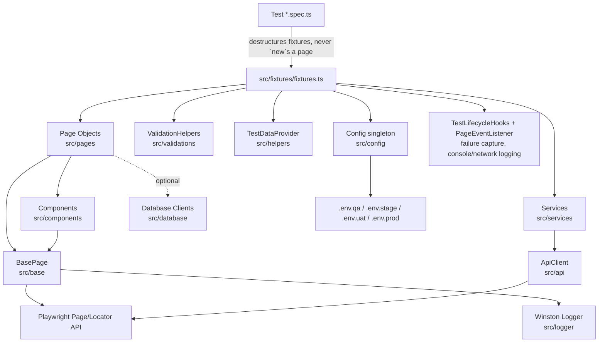

# QE Automation Framework

An enterprise-grade, TypeScript Playwright Test framework: Page Object Model + Component Object Model,
dependency-injected fixtures, environment-driven config, Winston logging, Allure/HTML reporting, and an
optional multi-database layer - built to scale to thousands of tests across parallel workers and CI.

## Contents
- [Architecture](#architecture)
- [Folder Structure](#folder-structure)
- [Git Ignore](#git-ignore)
- [Getting Started](#getting-started)
- [Running Tests](#running-tests)
- [How To...](#how-to)
- [End-to-End Walkthrough](#end-to-end-walkthrough-add-run-and-ship-a-new-test)
- [Running in Docker](#running-in-docker)
- [MCP Server](#mcp-server-ai-agent-tool-access)
- [AI Agents, Chatmodes & Skills](#ai-agents-chatmodes--skills)
- [Parallel Execution & Cross-Browser](#parallel-execution--cross-browser)
- [Visual Regression](#visual-regression)
- [Reporting & Logging](#reporting--logging)
- [Design Patterns Used](#design-patterns-used)
- [Coding Standards](#coding-standards)
- [CI/CD](#cicd)
- [Troubleshooting](#troubleshooting)

## Architecture



**Rule of thumb**: tests only do Arrange/Act/Assert with fixtures; page objects only do locators + actions +
navigation; components wrap one reusable UI pattern; assertions live in `ValidationHelpers` or `expect(...)`
in the test itself - never inside a page object.

## Folder Structure

```
src/
  base/          BasePage - every Playwright action (click, fill, wait*, etc.), no assertions
  pages/         Page Objects (LoginPage, DashboardPage, DemoPage, WeSendCVPage)
  components/    Component Object Model (HeaderComponent, NavigationMenu, TableComponent, Pagination,
                 ToastMessage, CommonDialog) - reused across pages instead of duplicated
  locators/      LocatorFactory (accessible-locator helpers) + CommonLocators (shared cross-page selectors)
  fixtures/      Dependency-injected Playwright fixtures - the only way tests get pages/services
  utils/         Stateless utility classes (Date/File/Json/CSV/Excel/Zip/Encryption/Network/Storage/...)
  helpers/       Test-context helpers (TestDataProvider, RetryHelper, ReportAttachmentHelper)
  constants/     Timeouts, Routes, Messages, Roles, EnvKeys, FilePaths, ReportNames
  config/        Config singleton - typed, env-driven getters; never hardcode URLs/creds/timeouts
  enums/         BrowserType, UserRole, Environment, Status, Country, Language, DatabaseType, ...
  interfaces/    IConfig and other cross-cutting contracts
  models/        Domain types (User, Job, ApiResponse)
  services/      Business/API service layer (AuthService, JobService) wrapping ApiClient
  api/           ApiClient - GET/POST/PUT/PATCH/DELETE + status/JSON assertions
  database/      Optional multi-DB layer (Postgres/MySQL/MsSql/Oracle) via Factory pattern
  hooks/         GlobalSetup/GlobalTeardown, TestLifecycleHooks (failure-only capture)
  listeners/     CustomReporter (execution summary), PageEventListener (console/network logging)
  logger/        Winston logger - daily rotating file + error file + console (dev only)
  validations/   ValidationHelpers - the only place assertions belong
  builders/      Builder Pattern test data (UserBuilder, JobBuilder)
  testdata/      Static/JSON/CSV test data, keyed by domain (urls, apiEndpoints, users, payloads)
  exceptions/    Typed errors (ConfigurationError, ElementError, APIError, DatabaseError, ValidationError,
                 FrameworkError)

tests/
  smoke/ sanity/ regression/ e2e/ api/          required by spec
  accessibility/ contract-tests/ chaos-tests/    additional specialized coverage kept alongside the above
  i18n-tests/ integration-tests/ interop-tests/
  mobile/ mock-tests/ network-resilience/
  performance-tests/ resilience/ security-tests/
  unit-tests/ validation-tests/ vibe/ wesendcv/

reports/ screenshots/ videos/ traces/ logs/      generated at runtime (gitignored)
.github/workflows/                               CI
demo/                                            local target app the smoke/sanity/e2e suite runs against
```

## Git Ignore

`.gitignore` keeps generated artifacts, secrets, and editor state out of version control:

| Pattern | Why it's ignored |
|---|---|
| `node_modules/`, `dist/` | Reinstalled from `package-lock.json` / rebuilt - never committed |
| `test-results/`, `playwright-report/`, `/reports/`, `/screenshots/`, `/videos/`, `/traces/`, `/logs/`, `/downloads/`, `junit.xml`, `test-results.json`, `playwright/.cache/` | Regenerated by every `npm test` run (see [Reporting & Logging](#reporting--logging)) - committing them would just churn diffs on every run |
| `allure-results/`, `allure-report/` | Allure's raw results and generated static site (see [Allure Reporting](#allure-reporting)) - ignored unrooted so both the configured `reports/allure-results` / `reports/allure-report` paths *and* a root-level `allure-results/`/`allure-report/` (e.g. from running `allure generate`/`allure serve` without the `reports/` prefix) are covered |
| `artifacts/`, `coverage/` | Build/test-coverage output, same reasoning |
| `src/testdata/storage-state/` | Cached `storageState` JSON (e.g. `admin.json`) written by the `authenticatedPage` fixture in `src/fixtures/fixtures.ts` - contains session cookies/tokens, so it must never be committed |
| `.env`, `.env.local` | Real credentials/URLs. Only `.env.example` (a template with placeholder values) is committed - `.env.qa`/`.env.stage`/`.env.uat`/`.env.prod` in this repo are local starting points you fill in yourself and should not carry real secrets either |
| `*.log`, `*.swp`, `*.swo`, `.DS_Store` | Editor/OS/logging cruft with no place in the repo |
| `.idea/`, `.vscode/` | Personal IDE settings - keep your own editor config local, don't force it on collaborators |

**If you add a new generated output directory or a new local-only env/data file**, add its pattern to
`.gitignore` in the same commit - don't rely on remembering to `git rm --cached` it later. Run
`git status` before staging broadly (`git add .`) to make sure nothing matching the table above (especially
credentials or `storage-state/`) slips in by accident.

## Getting Started

### Prerequisites
- Node.js 20+ and npm
- Git
- Docker (optional - only needed for containerized runs, see [Running in Docker](#running-in-docker))

### Step-by-step setup
1. **Clone and enter the repo**
   ```bash
   git clone <repo-url>
   cd Playwright_aI
   ```
2. **Install dependencies**
   ```bash
   npm install
   ```
3. **Install Playwright browsers** (chromium/firefox/webkit + OS deps)
   ```bash
   npm run install:browsers
   ```
4. **Configure environment variables** - copy the example file and adjust values for your target environment
   ```bash
   cp .env.example .env.qa
   ```
   `.env.qa` / `.env.stage` / `.env.uat` / `.env.prod` already exist as starting points; edit the one you
   need or add a new tier (see [Add a new environment](#how-to)). Never commit real credentials.
5. **Run the suite**
   ```bash
   npm test
   ```
   `npm test` starts `tools/dev-server.js` automatically (via Playwright's `webServer`) and serves the
   `demo/` app at `http://127.0.0.1:3000` - no separate setup needed for the smoke/sanity/regression/e2e
   suites.
6. **Open the report**
   ```bash
   npx playwright show-report reports/html
   ```

### Git hooks
`npm install` triggers `prepare` → `husky`, wiring up `.husky/pre-commit`, which runs `lint-staged`
(ESLint --fix + Prettier) on staged `*.{js,ts}` files before every commit.

## Running Tests

| Command | What it runs |
|---|---|
| `npm test` | Everything, all projects (chromium/firefox/webkit/mobile) |
| `npm run test:smoke` / `test:sanity` / `test:regression` / `test:e2e` / `test:api` | One required category |
| `npm run test:headed` / `test:debug` / `test:ui` | Debugging modes |
| `npx playwright test --project=chromium` | One browser only |
| `BROWSER=firefox npm test` | Env-driven browser selection (Strategy pattern, see `BrowserUtils.buildProjects()`) |
| `ENVIRONMENT=stage npm test` | Loads `.env.stage` via the `Config` singleton |

Environments are `.env.qa` / `.env.stage` / `.env.uat` / `.env.prod` (copy `.env.example` to add your own).
`Config` (`src/config/Config.ts`) is a Singleton exposing strongly typed getters - `Config.baseUrl`,
`Config.adminUsername`, `Config.browser`, `Config.retries`, etc. Nothing in the framework hardcodes a URL,
credential, or timeout; everything routes through `Config` or `src/constants/`.

## How To...

**Add a new page**: create `src/pages/MyPage.ts` extending `BasePage`, declare locators + actions +
navigation only (no assertions), then add a fixture for it in `src/fixtures/fixtures.ts` so tests never
`new` it directly.

**Add a new component**: create `src/components/MyComponent.ts` extending `BaseComponent`, scope it to a
root `Locator`, and compose it into whichever page(s) use it (see `DashboardPage` composing
`HeaderComponent` + `NavigationMenu` + `TableComponent` + `Pagination` + `ToastMessage` + `CommonDialog`).

**Add a new test**: put a `*.spec.ts` file in the right `tests/<category>/` folder, import
`{ test, expect }` from `src/fixtures/fixtures` (not `@playwright/test` directly), and keep the test body to
Arrange/Act/Assert - business logic belongs in the page object or a service.

**Add a new environment**: create `.env.<name>`, add the value to `Environment` (`src/enums/Environment.ts`)
if it's a brand-new tier, then run with `ENVIRONMENT=<name> npm test`.

**Add DB validation**: `src/database/DatabaseClientFactory.create(DatabaseType.POSTGRES, options)` returns an
`IDatabaseClient`. None of the four drivers (`pg`, `mysql2`, `mssql`, `oracledb`) are installed by default -
install only the one you need (e.g. `npm install pg`); the client throws a clear `DatabaseError` telling you
which package is missing if you forget.

## End-to-End Walkthrough: Add, Run, and Ship a New Test

This stitches every section above into one concrete pass - from a clean clone to a merged, CI-verified test -
using the real `demo/` app and `DemoPage` already in this repo.

### 1. Set up once
```bash
git clone <repo-url> && cd Playwright_aI
npm install                 # also wires up the husky pre-commit hook
npm run install:browsers
cp .env.example .env.qa     # edit BASE_URL/credentials if not using the bundled demo app
```

### 2. Confirm the baseline is green
```bash
npm run test:smoke
```
This starts `tools/dev-server.js` (via Playwright's `webServer`) at `http://127.0.0.1:3000`, runs
`tests/smoke/demo-smoke.spec.ts` against the bundled `demo/` app, and should pass with zero extra setup.

### 3. Extend a Page Object
`src/pages/DemoPage.ts` already exposes `clickNavButton()` / `getNavButton()` but nothing exercises them
yet. Page objects only add locators + actions - never assertions:
```ts
// src/pages/DemoPage.ts
public async goToAbout(): Promise<void> {
  await this.clickNavButton();
  await this.page.waitForURL('**/about');
}
```

### 4. Fixtures - nothing to wire for an existing page
`demoPage` is already registered in `src/fixtures/fixtures.ts`
(`demoPage: async ({ page }, use) => use(new DemoPage(page))`). For a brand-new page you'd add one entry
here (see [How To...](#how-to)); existing pages need no fixture changes.

### 5. Write the test
```ts
// tests/smoke/demo-navigation.spec.ts
import { test, expect } from '../../src/fixtures/fixtures';

test.describe('Demo Page - Navigation', () => {
  test('should navigate to the about page', async ({ demoPage, page }) => {
    // Arrange
    await demoPage.goToDemo();

    // Act
    await demoPage.goToAbout();

    // Assert
    await expect(page).toHaveURL(/about/);
  });
});
```
Import `{ test, expect }` from `src/fixtures/fixtures`, never `@playwright/test` directly - that's what
wires in `PageEventListener` (console/network logging) and `TestLifecycleHooks.captureOnFailure`
automatically for every test, with no extra setup in the spec itself.

### 6. Run it locally
```bash
npx playwright test tests/smoke/demo-navigation.spec.ts --project=chromium   # headless, one browser
npm run test:headed                                                          # watch it in a real browser
npm run test:ui                                                              # interactive UI mode
npm run test:debug                                                           # step through with the inspector
```

### 7. If it fails, use the failure artifacts
A failure automatically captures a screenshot, video, trace, and the last 50 Winston log lines
(`TestLifecycleHooks.captureOnFailure` - see [Reporting & Logging](#reporting--logging)). Inspect them via:
```bash
npx playwright show-report reports/html
npx playwright show-trace reports/html/data/<trace-file>.zip
```

### 8. Check the full picture before committing
```bash
npm run lint && npm run typecheck
npm test                              # full cross-browser run (chromium/firefox/webkit/mobile)
npm run allure:generate && npm run allure:open
```

### 9. Commit
```bash
git add tests/smoke/demo-navigation.spec.ts src/pages/DemoPage.ts
git commit -m "Add demo navigation smoke test"
```
`.husky/pre-commit` runs `lint-staged` (ESLint --fix + Prettier) on staged files automatically, so a commit
with lint/format issues gets auto-fixed or blocked before it lands.

### 10. Push - CI takes over
`.github/workflows/ci.yml` runs on every push/PR to `main`/`master`:
```
checkout -> setup-node(20) -> npm ci -> lint -> typecheck -> install:browsers -> npm test -> allure:generate -> upload-artifact
```
Download the `playwright-report` artifact from the Actions run to inspect the HTML/Allure/JUnit output CI
produced, or trigger a run manually with a chosen environment/browser via the `workflow_dispatch` inputs on
the Actions tab (see [CI/CD](#cicd)).

That covers the full lifecycle: local setup → writing the page object/fixture/test → local debugging →
pre-commit checks → CI verification → shareable reports.

## Running in Docker

The image is based on `mcr.microsoft.com/playwright:v1.59.1-jammy` (browsers preinstalled) and copies the
repo in, installs deps, and runs `npm test` on container start.

```bash
docker compose up --build
```

`docker-compose.yml` builds from the local `Dockerfile` and mounts `./playwright-report` and
`./test-results` back to the host so reports survive after the container exits. To run a specific suite
instead of the full `npm test` default, override the command:

```bash
docker compose run --rm playwright-tests npm run test:smoke
```

## MCP Server (AI agent tool access)

`mcp/mcp-server.ts` wraps this framework as a [Model Context Protocol](https://modelcontextprotocol.io)
server, built on `@modelcontextprotocol/sdk`. It communicates over **stdio** (not HTTP), so any
MCP-compatible LLM client - Claude Desktop, Claude Code, VS Code's MCP support, Cursor, etc. - can launch it
as a subprocess and call test runs as structured tool calls instead of you (or the agent) shelling out to
`npx playwright test` by hand.

### Run it standalone
```bash
npm run mcp:server
```
This just starts the server on stdio and blocks (`tsx mcp/mcp-server.ts` under the hood) - it's meant to be
launched *by* an MCP client, not left running in a terminal for manual use.

### Exposed tools
| Tool | Arguments | What it does |
|---|---|---|
| `run_playwright_test` | `testFile` (string, **required**), `project` (string, optional), `headed` (boolean, optional, default `false`) | Runs `npx playwright test <testFile>`, appending `--project=<project>` and/or `--headed` when supplied |
| `run_all_tests` | none | Runs the full `npx playwright test` suite (all projects) |
| `get_test_report` | none | Lists the contents of `playwright-report/` so the agent can confirm a report was generated |

Each tool returns its `stdout`/`stderr` as plain text content; a thrown error is returned as an MCP tool
error (`isError: true`) with the message, rather than crashing the server - so a failing test run comes back
as a normal (failed) tool result the calling agent can read and react to, not a broken connection.

### Wiring it into an MCP client
Point the client's MCP server config at the `tsx` entrypoint (absolute path recommended, since MCP clients
usually launch it from their own working directory), for example in Claude Desktop's
`claude_desktop_config.json` or an equivalent VS Code MCP settings block:
```json
{
  "mcpServers": {
    "playwright-ai-agent": {
      "command": "npx",
      "args": ["tsx", "mcp/mcp-server.ts"],
      "cwd": "/absolute/path/to/Playwright_aI"
    }
  }
}
```
Once connected, ask the client something like "run tests/smoke/demo-smoke.spec.ts headed" or "run the full
suite and get me the report" - it resolves to `run_playwright_test`/`run_all_tests` + `get_test_report` calls
automatically.

> **Security note**: the server shells out via Node's `exec` using the tool arguments you pass it (e.g.
> `testFile`, `project`). Only expose this MCP server to trusted clients/agents on your own machine - it is
> not designed to be exposed to untrusted input or over a network transport.

## AI Agents, Chatmodes & Skills

This repo ships prebuilt AI agent configurations for Copilot/VS Code agent mode and Claude Code: **five
chatmodes** (each a persona you switch into) plus **two auto-loaded skills** (behavior Copilot applies
without switching anything).

| Location | What it's for |
|---|---|
| `.github/chatmodes/` | Five chatmodes - Healer, Planner, Generator, API Testing, Manual Testing |
| `.github/skills/` | Copilot auto-loaded skills: `playwright-test-debugging`, `code-review` |
| `.claude/skills/playwright-cli/` | Claude Code skill for driving the Playwright CLI |
| `docs/ai-agents.md` | Full agent reference: activation steps, example prompts, per-agent behavior |
| `docs/common-workflows.md` | End-to-end recipes that chain multiple agents (e.g. plan → generate → heal) |
| `docs/agent-capability-matrix.md` | Which agent handles which task, at a glance |
| `docs/manual-test-checklist.md` | Template used by the Manual Testing agent's output |

### Starting an Agent in VS Code
The five chatmodes are picked up automatically by GitHub Copilot Chat in VS Code - no extra install beyond
having the Copilot Chat extension enabled for this workspace.

**Option A - Copilot Chat panel:**
1. Press `Cmd+Alt+I` (macOS) / `Ctrl+Alt+I` (Windows/Linux) to open Copilot Chat.
2. Click the agent/chatmode dropdown at the top of the chat panel.
3. Select one of: Healer, Planner, Generator, API Testing, Manual Testing.
4. Type your request and send.

**Option B - Command Palette:**
1. Press `Cmd+Shift+P` (macOS) / `Ctrl+Shift+P` (Windows/Linux).
2. Run `GitHub Copilot: Open Chat`.
3. Select the desired chatmode from the panel, then type your request.

**Option C - `@mention` shorthand** (skip the dropdown, prefix your message directly in chat):
```
@healer Fix the failing test in tests/wesendcv.spec.ts
@planner Create a test plan for https://example.com
```

The two skills in `.github/skills/` (`playwright-test-debugging`, `code-review`) need no manual activation -
Copilot auto-loads them based on what you're doing (debugging a failing test, reviewing test code).

If you're driving the framework from Claude Code instead of Copilot, use `/playwright-cli` (backed by
`.claude/skills/playwright-cli/`) or the MCP server tools described above.

### Chatmode-by-Chatmode: Step-by-Step

#### 🩺 Healer - `.github/chatmodes/healer.chatmode.md`
**Use when**: a test is red and you want it diagnosed and fixed instead of debugging it by hand.
1. Activate it (any option above) and describe the failure, e.g.
   `@healer Fix the failing test in tests/wesendcv.spec.ts - it timed out waiting for "Sign Up"`.
2. Per its instructions, it analyzes the failure - checking traces/screenshots/videos, selector stability,
   and race conditions/timing (see [Reporting & Logging](#reporting--logging) for where those artifacts live).
3. It proposes fixes: updated selectors, added waits, or improved assertions - and, in agent mode, edits the
   page object/spec directly rather than just describing the fix.
4. Re-run the test yourself to confirm: `npx playwright test tests/wesendcv.spec.ts --project=chromium`.

#### 📋 Planner - `.github/chatmodes/planner.chatmode.md`
**Use when**: you need a full test plan for a page/feature before writing any code.
1. Activate it and give it a target, e.g. `@planner Create a test plan for the CV upload feature at
   https://wesendcv.com/upload`.
2. It analyzes the app under test and enumerates scenarios - positive, negative, and edge cases - across
   categories (e2e, accessibility, performance, mobile, visual, etc.), following this repo's POM conventions.
3. It outputs a structured plan (scenario list + suggested Page Object Model shape + test data needs) you can
   save to a markdown file and hand to the Generator agent.

#### ⚙️ Generator - `.github/chatmodes/generator.chatmode.md`
**Use when**: you have a plan (or a clear feature in mind) and want Playwright code written for it.
1. Activate it and ask for a spec or page object, e.g. `@generator Write a Playwright test spec for the
   WeSendCV login page` or `@generator Create a POM class for the search results page`.
2. It writes `*.spec.ts` files and/or creates or extends classes in `src/pages/`, following this repo's
   naming conventions and reusing existing `BasePage` actions and `src/testdata/` fixtures rather than
   inventing new ones.
3. Review the generated file, then run it: `npx playwright test <new-spec> --headed` to sanity-check before
   committing (see [End-to-End Walkthrough](#end-to-end-walkthrough-add-run-and-ship-a-new-test)).

#### 🔌 API Testing - `.github/chatmodes/api-testing.chatmode.md`
**Use when**: you need API or contract tests scaffolded for a REST endpoint.
1. Activate it and name the endpoint, e.g. `@api-testing Create API tests for /api/jobs at
   https://api.wesendcv.com`.
2. It scaffolds (or extends): `src/testdata/apiEndpoints.testdata.ts` (centralized endpoints),
   `src/testdata/payloads.testdata.ts` (valid/invalid bodies), `src/api/ApiClient.ts` /
   `src/services/*Service.ts` (request builders/auth helpers), `tests/api/*.spec.ts`, and
   `tests/contract-tests/api-contract.spec.ts` (Pact contracts) - and can update `package.json` with
   matching `test:api`/`test:contract` scripts.
3. Run the result: `npm run test:api` or `npm run test:contract`.

#### 📝 Manual Testing - `.github/chatmodes/manual-testing.chatmode.md`
**Use when**: you need a QA checklist rather than automated code (e.g. for exploratory or release sign-off
testing).
1. Activate it and name a page/feature, e.g. `@manual-testing Give a manual testing checklist for the
   WeSendCV homepage`.
2. It produces a checklist covering Page Load & Navigation, Feature-Specific Tests, Visual & Performance
   Checks, Cross-Browser & Cross-Device, Accessibility (a11y), and Error & Resilience Cases - with
   checkboxes, time estimates, and pass/fail criteria, matching the template in
   `docs/manual-test-checklist.md`.

### Skills: No Activation Needed

#### 🔍 Code Review - `.github/skills/code-review/SKILL.md`
Copilot auto-loads this when you ask it to review or audit test code (e.g. `Review tests/wesendcv.spec.ts
for POM compliance and security`). It checks POM compliance (no raw selectors in specs), Playwright
anti-patterns (`waitForTimeout`, brittle XPath, positional selectors, `networkidle` misuse), hardcoded
credentials, missing negative/accessibility/performance coverage, and naming consistency - then reports
findings graded 🔴 Critical / 🟡 Warning / 💡 Suggestion, each with a concrete fix.

#### 🛠️ Playwright Test Debugging - `.github/skills/playwright-test-debugging/SKILL.md`
Copilot auto-loads this while you're debugging a failing test. It walks a fixed sequence: (1) check
artifacts in `test-results/`, (2) review selectors/waits/assertions in the test code, (3) re-run with
`--headed` to watch it execute, (4) re-run with `--debug` to step through in the Inspector, (5) check
network logs, (6) validate the Page Object Model locators/methods - matching the same
`npx playwright test <spec> --debug` / `--headed --project=chromium` commands used elsewhere in this README.

See `docs/ai-agents.md` for the full walkthrough (per-agent behavior, example workflows, and prompt
tables), and `docs/common-workflows.md` for recipes that chain agents together (e.g. Planner → Generator →
Healer).

## Parallel Execution & Cross-Browser

`fullyParallel: true` in `playwright.config.ts`; each test gets an isolated `BrowserContext` via Playwright's
built-in worker model, so there's no shared mutable state to coordinate. Projects are built by
`BrowserUtils.buildProjects()` (Strategy pattern per browser) - by default chromium/firefox/webkit + two
mobile profiles all run; set `BROWSER=<chromium|firefox|webkit>` to pin one, or `--project=<name>` at the CLI.

## Visual Regression

`tools/compare.js` does pixel-level image diffing (`pixelmatch` + `pngjs`) for the `tests/visual` suite:

```bash
npm run compare -- <baseline.png> <current.png> <diff.png> [--threshold=0.03]
```

If `baseline.png` doesn't exist yet, it's created from `current.png` and the run exits 0 (first-run
bootstrap); otherwise it writes a diff image and fails if the mismatch ratio exceeds `--threshold`.

## Reporting & Logging

- **Playwright HTML report**: `reports/html` (`npx playwright show-report reports/html`)
- **Allure**: see [Allure Reporting](#allure-reporting) below
- **JUnit/JSON**: `reports/junit.xml`, `reports/test-results.json` (CI-friendly)
- **CustomReporter** (`src/listeners/CustomReporter.ts`): structured pass/fail/skip/duration/retry summary
  logged through Winston, not stdout
- **Logs**: `logs/app-<date>.log` (info+) and `logs/error.log` (errors only), daily-named, no `console.log`
  anywhere in framework code
- **Failure capture**: `TestLifecycleHooks.captureOnFailure` (wired into the overridden `page` fixture) takes
  a screenshot and attaches the last 50 log lines to the test report automatically - only on failure

### Allure Reporting

The `allure-playwright` reporter is registered in `playwright.config.ts` alongside html/junit/json, so every
`npm test` (or any `npx playwright test ...` run) writes raw Allure results automatically - no separate
recording step needed.

**Pipeline:**
```
npm test                 # writes raw results to reports/allure-results/
  |
npm run allure:generate  # reports/allure-results/  ->  reports/allure-report/ (static HTML site)
  |
npm run allure:open      # serves reports/allure-report/ in a browser
```

| Command | What it does |
|---|---|
| `npm run allure:generate` | `allure generate reports/allure-results --clean -o reports/allure-report` - builds the static site, wiping any previous build first |
| `npm run allure:open` | Opens the already-generated `reports/allure-report` in a browser |
| `npm run allure:serve` | `allure serve reports/allure-results` - generates into a temp dir and opens it in one step, skipping the persistent `reports/allure-report` output (handy for a quick local look) |

**Environment tab**: `src/hooks/GlobalSetup.ts` runs once before the suite and writes
`reports/allure-results/environment.properties` with `Environment`, `Base.URL`, `Browsers` (the joined
project names), `Retries`, and `Workers` - so every Allure report's *Environment* tab shows exactly what
config (`.env.qa` vs `.env.stage`, which browsers, CI retry count) produced that run, without digging
through CI logs.

**What you get beyond the plain HTML report**: suite/feature grouping via `test.describe`, historical
trend graphs (Allure preserves history across `allure generate` runs against the same `reports/allure-report`
directory unless `--clean` wipes it), retry timelines, and attachments (screenshots/logs from
`TestLifecycleHooks.captureOnFailure`) inline per test step.

**In CI**: `.github/workflows/ci.yml` runs `npm run allure:generate` after the test step (`if:
!cancelled()`, so it runs even on failure) and uploads the whole `reports/` folder - including
`allure-report/` - as the `playwright-report` artifact; download it from the Actions run summary and open
`reports/allure-report/index.html` locally, since GitHub Actions artifacts aren't served as live web pages.

## Design Patterns Used

Page Object Model, Component Object Model, Factory (`DatabaseClientFactory`), Singleton (`Config`, `Logger`),
Builder (`UserBuilder`, `JobBuilder`), Strategy (`BrowserUtils` browser selection), Dependency Injection
(Playwright fixtures), Utility Pattern (`*Utils` static classes), Fluent API (builders' `.withX().build()`).

## Coding Standards

- No duplicated Playwright actions - everything routes through `BasePage`
- No assertions/validations/business logic in page objects - that's `ValidationHelpers` or the test itself
- No hardcoded URLs, credentials, or timeouts - use `Config` / `src/constants`
- No manual page-object instantiation in tests - use fixtures
- Prefer `getByRole` / `getByLabel` / `getByPlaceholder` / `getByText` / `getByTestId`; avoid CSS, never XPath

## CI/CD

`.github/workflows/ci.yml` runs lint → typecheck → Playwright tests → Allure report generation → artifact
upload on every push/PR, with a `workflow_dispatch` trigger to pick environment/browser manually.

## Troubleshooting

- Failing test? Check `reports/html` first - it has the screenshot/video/trace plus attached log tail.
- `npm run test:debug` or `npm run test:ui` for interactive debugging.
- Browser install issues: `npm run install:browsers`.
- AI agents/chatmodes for planning, generation, healing, and review are documented in `docs/ai-agents.md`.
