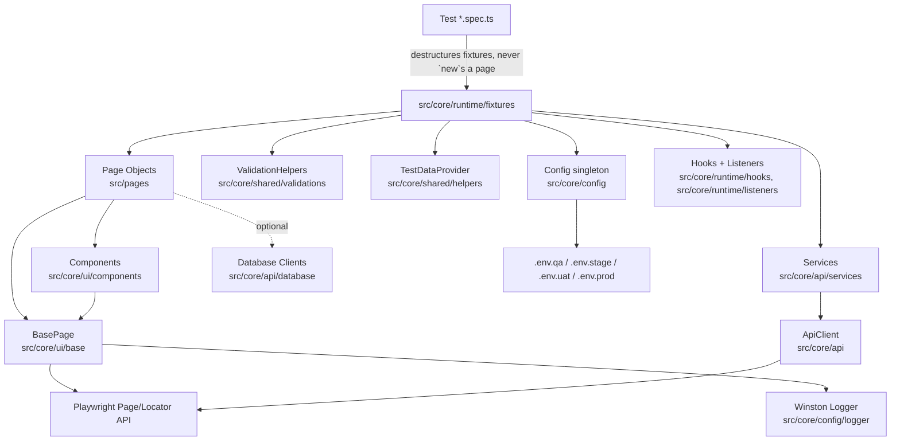

# QE Automation Framework

An enterprise-grade, TypeScript Playwright Test framework featuring:
- **Page Object Model (POM) + Component Object Model (COM)**: For maintainable, scalable UI automation
- **Dependency-Injected Fixtures**: Automatically inject pages, services, and helpers into tests
- **Environment-Driven Config**: Multi-environment support via `.env.qa`, `.env.stage`, `.env.uat`, `.env.prod`
- **Advanced Reporting**: Playwright HTML, Allure, JUnit, and custom reporting with screenshots/videos/traces on failure
- **Winston Logging**: Daily rotating logs, console output (dev only), and structured logging
- **AI-Powered Development**: Built-in chatmodes for planning, generation, healing, and review (see [docs/ai-agents.md](file:///Users/sureshbabuisreal/Documents/PersonalGithub/Playwright_aI/docs/ai-agents.md))

## Table of Contents
- [Architecture](#architecture)
- [Folder Structure](#folder-structure)
- [Prerequisites](#prerequisites)
- [Getting Started](#getting-started)
  - [Step 1: Install Dependencies](#step-1-install-dependencies)
  - [Step 2: Configure Environment](#step-2-configure-environment)
  - [Step 3: Install Browsers](#step-3-install-browsers)
  - [Step 4: Run Your First Tests](#step-4-run-your-first-tests)
- [Core Concepts](#core-concepts)
- [Running Tests](#running-tests)
  - [Test Categories](#test-categories)
  - [Sample Scripts](#sample-scripts-testszsamplescript)
  - [Browser & Environment Selection](#browser--environment-selection)
  - [Debugging Modes](#debugging-modes)
- [How-To Guides](#how-to-guides)
  - [How to Add a New Page Object](#how-to-add-a-new-page-object)
  - [How to Add a New Component](#how-to-add-a-new-component)
  - [How to Add a New Test](#how-to-add-a-new-test)
  - [How to Add a New Environment](#how-to-add-a-new-environment)
  - [How to Use the API Client](#how-to-use-the-api-client)
- [Reporting & Logging](#reporting--logging)
- [Coding Standards](#coding-standards)
- [CI/CD](#cicd)
- [Troubleshooting](#troubleshooting)

---

## Architecture

**Rule of Thumb**:
- Tests only: `Arrange → Act → Assert` using fixtures
- Page Objects only: Locators, Actions, Navigation
- Assertions: In tests or `ValidationHelpers`
- Components: Reusable UI patterns across pages

---

## Folder Structure
`src/pages/` sits directly under `src/` since it's what tests touch most directly. Everything else -
the framework "engine" - lives under `src/core/`, grouped by architectural role:

| Path | Contains | Purpose |
|------|---------|---------|
| `src/pages/` | `LoginPage.ts`, `DashboardPage.ts`, `DemoPage.ts`, `WeSendCVPage.ts` | Page Objects - the layer tests interact with |
| `src/core/ui/` | `base/`, `components/`, `locators/` | Everything else that touches the Playwright Page/Locator API directly |
| `src/core/api/` | `ApiClient.ts` (root), `services/`, `database/` | Backend/data I/O - API client, business services, optional multi-DB layer |
| `src/core/runtime/` | `fixtures/`, `hooks/`, `listeners/` | Test lifecycle wiring - dependency injection, setup/teardown, console/network logging |
| `src/core/data/` | `testdata/`, `builders/`, `models/`, `enums/` | Test data & domain shapes |
| `src/core/config/` | `Config.ts` (root), `constants/`, `logger/` | Environment config and cross-cutting constants/logging |
| `src/core/shared/` | `interfaces/`, `exceptions/`, `helpers/`, `utils/`, `validations/` | Cross-cutting support used across all the groups above |

| Path | Purpose |
|------|---------|
| `.github/workflows/` | CI pipeline |
| `tests/smoke/` | Critical path smoke tests |
| `tests/sanity/` | Quick sanity checks for PRs |
| `tests/regression/` | Full regression suite |
| `tests/api/` | API tests |
| `tests/e2e/` | End-to-end user flows |
| `reports/` | All generated output lives here (gitignored) |
| `reports/allure-results/`, `reports/allure-report/` | Raw Allure results / generated static site |
| `reports/test-results/` | Playwright's own per-test artifacts (screenshots/videos/traces on failure, `.last-run.json`) |
| `reports/screenshots/` | Ad-hoc named screenshots + auto-capture on test failure |
| `reports/videos/` | Reserved for video output |
| `reports/logs/` | Winston app/error logs and Playwright traces, combined in one folder |

---

## Prerequisites
| Tool | Required Version |
|------|-------------------|
| Node.js | 18+ |
| npm | 9+ |
| Git | Latest |

---

## Getting Started

### Step 1: Install Dependencies
```bash
npm install
```

### Step 2: Configure Environment
1. Copy the example environment file to your target environment:
   ```bash
   cp .env.example .env.qa
   ```
2. Update `.env.qa` with your environment's URLs, credentials, and settings:
   ```env
   ENVIRONMENT=qa
   BASE_URL=http://127.0.0.1:3000
   API_BASE_URL=http://127.0.0.1:3000/api
   ADMIN_USERNAME=admin@example.com
   ADMIN_PASSWORD=AdminPass123!
   HEADLESS=true
   PARALLEL_WORKERS=4
   RETRIES=2
   ```

### Step 3: Install Browsers
```bash
npm run install:browsers
```

### Step 4: Run Your First Tests
The framework includes a local demo app for quick validation! Just run:
```bash
npm test
```
This will automatically start `src/core/tools/dev-server.js` and serve the `demo/` app at `http://127.0.0.1:3000`.

---

## Core Concepts

### Fixtures
Fixtures are the only way tests should get access to page objects, services, and helpers! No manual `new` keyword in tests!

**Sample Fixture (`tests/fixtures/page.fixture.ts`)**:
```typescript
import { test as base } from '@playwright/test';
import { LoginPage } from '@pages/auth/login.page';

type PageFixtures = {
  loginPage: LoginPage;
};

export const test = base.extend<PageFixtures>({
  loginPage: async ({ page }, use) => {
    await use(new LoginPage(page));
  },
});
```

---

## Running Tests

### Test Categories
| Command | What it runs |
|---------|--------------|
| `npm test` | All tests across all browsers |
| `npm run test:smoke` | Critical path smoke tests |
| `npm run test:sanity` | Quick PR sanity checks |
| `npm run test:regression` | Full regression suite |
| `npm run test:api` | API-only tests |
| `npm run test:e2e` | End-to-end user flows |

### Sample Scripts (`tests/zsampleScript/`)
Thirteen reference specs, one per testing category this framework supports, each a small, real,
passing example of that category's technique - a "how do I write this kind of test here" reference,
not part of the required smoke/sanity/regression/e2e/api suites.

```bash
npx playwright test tests/zsampleScript                              # all 13 categories
npx playwright test tests/zsampleScript --project=chromium           # one browser only
npx playwright test tests/zsampleScript/security-tests.sample.spec.ts # a single category
```

| File | Category |
|---|---|
| `unit-tests.sample.spec.ts` | Unit - individual functions/utilities, no browser |
| `integration-tests.sample.spec.ts` | Integration - multi-step workflows across components |
| `performance-tests.sample.spec.ts` | Performance - load time, FCP, resource count |
| `security-tests.sample.spec.ts` | Security - auth, XSS prevention, header validation |
| `validation-tests.sample.spec.ts` | Validation - format, length, malicious-pattern input |
| `mock-tests.sample.spec.ts` | Mock - stubbed/aborted responses, simulated failures |
| `interop-tests.sample.spec.ts` | Interop - CSS/ES6 feature support, viewport |
| `accessibility-tests.sample.spec.ts` | Accessibility - axe scan, keyboard nav, focus order |
| `resilience-tests.sample.spec.ts` | Resilience - asset failures, partial outages |
| `network-resilience-tests.sample.spec.ts` | Network-resilience - offline, slow, dropped connections |
| `i18n-tests.sample.spec.ts` | i18n - language attributes, direction, pluralization |
| `e2e-tests.sample.spec.ts` | E2E - full critical-path journey via POM |
| `chaos-tests.sample.spec.ts` | Chaos - concurrency, partial failures, random delays |

These run against the bundled `demo/` app and follow every framework convention (fixtures import,
POM, `ValidationHelpers`, `Config`, builders) - since `testDir` covers all of `tests/`, they're also
included automatically in a plain `npm test`.

Every sample also demonstrates rich Allure reporting via `allure-js-commons` (a direct devDependency,
matched to `allure-playwright`'s version) rather than relying only on Playwright's own
failure-only screenshot/video capture:
- **`allure.step(name, fn)`** wraps each Arrange/Act/Assert phase so the report shows a readable
  step timeline instead of one flat pass/fail line
- **`allure.attachment(name, buffer, ContentType.PNG/JSON)`** attaches a screenshot or JSON payload
  at key checkpoints - on *every* run, not just failures
- **`allure.epic()` / `feature()` / `severity()`** label each test so the report's Behaviors view
  groups them by category instead of by file
- `e2e-tests.sample.spec.ts` additionally shows how to attach a **video**: a dedicated
  `browser.newContext({ recordVideo: ... })` is required (the default fixture context only saves
  video on failure), and the file must be read via `page.video()?.path()` **after** `context.close()`
  finalizes it, then attached with `allure.attachmentPath(name, path, ContentType.WEBM)`

Regenerate the report after any test run to see this (`npm run allurereport`) - see
[Reporting & Logging](#reporting--logging).

### Browser & Environment Selection
| Command | Effect |
|---------|--------|
| `npx playwright test --project=chromium` | Run tests only in Chromium |
| `ENVIRONMENT=stage npm test` | Use `.env.stage` config |

### Debugging Modes
| Mode | Command |
|------|---------|
| Headed (Visible Browser) | `npm run test:headed` |
| Playwright Debugger | `npm run test:debug` |
| Playwright UI Mode | `npm run test:ui` |

---

## How-To Guides

### How to Add a New Page Object
1. Create a new file in `src/pages/<feature>/`:
   ```typescript
   // src/pages/checkout/checkout.page.ts
   import { Page, Locator } from '@playwright/test';
   import { BasePage } from '@core/base.page';

   export class CheckoutPage extends BasePage {
     private cartItem: Locator;
     private checkoutButton: Locator;

     constructor(page: Page) {
       super(page);
       this.cartItem = this.page.getByTestId('cart-item');
       this.checkoutButton = this.page.getByRole('button', { name: 'Checkout' });
     }

     async navigate(): Promise<void> {
       await this.navigateTo('/checkout');
     }

     async clickCheckout(): Promise<void> {
       await this.click(this.checkoutButton);
     }
   }
   ```
2. Add a fixture for it in `tests/fixtures/page.fixture.ts`
3. Use it in a test:
   ```typescript
   import { test, expect } from '@tests/fixtures/test.fixture';

   test('checkout flow', async ({ checkoutPage }) => {
     await checkoutPage.navigate();
     await checkoutPage.clickCheckout();
   });
   ```

### How to Add a New Component
Components are reusable UI patterns across pages!
1. Create `src/pages/components/modal.component.ts`:
   ```typescript
   import { Page, Locator } from '@playwright/test';
   import { BaseComponent } from '@core/base.component';

   export class ModalComponent extends BaseComponent {
     private confirmButton: Locator;

     constructor(page: Page, rootSelector: string) {
       super(page, rootSelector);
       this.confirmButton = this.rootLocator.getByRole('button', { name: 'Confirm' });
     }

     async confirm(): Promise<void> {
       await this.click(this.confirmButton);
     }
   }
   ```
2. Use it in a page object:
   ```typescript
   this.modal = new ModalComponent(this.page, '[data-testid="checkout-modal"]');
   ```

### How to Add a New Test
1. Create a new test in the appropriate `tests/<category>/` folder
2. Use fixtures for all dependencies:
   ```typescript
   import { test, expect } from '@tests/fixtures/test.fixture';

   test.describe('Login', () => {
     test('valid credentials should login successfully', async ({
       loginPage,
       validationHelpers,
       config,
     }) => {
       // Arrange
       await loginPage.navigate();

       // Act
       await loginPage.login(config.adminUsername, config.adminPassword);

       // Assert
       await validationHelpers.verifyUrl(/\/dashboard/);
     });
   });
   ```

### How to Add a New Environment
1. Create a new `.env.<name>` file (e.g., `.env.preprod`)
2. (Optional) Add the environment to `Environment` enum in `src/test-data/constants/Environment.ts`
3. Run with `ENVIRONMENT=<name> npm test`

### How to Use the API Client
1. Import from `src/api/clients/` or use the `apiClient` fixture:
   ```typescript
   import { test, expect } from '@tests/fixtures/test.fixture';

   test('get users list', async ({ apiClient }) => {
     const response = await apiClient.get('/users');
     await apiClient.expectStatus(response, 200);
     const users = await apiClient.getJson<User[]>(response);
     expect(users.length).toBeGreaterThan(0);
   });
   ```

---

## Reporting & Logging
| Report Type | Location/Command |
|-------------|-------------------|
| Playwright HTML | `reports/playwright-report/`, open with `npx playwright show-report reports/playwright-report` |
| Allure | Generate: `npm run allure:generate`, Open: `npm run allure:open`, Serve: `npm run allure:serve` |
| JUnit | `reports/junit.xml` |
| JSON | `reports/test-results.json` |
| Logs | `reports/logs/app-<date>.log` (info+) and `reports/logs/error.log` (errors only) - same folder as Playwright traces |

---

## Coding Standards
| Rule | Details |
|------|---------|
| No Duplication | All Playwright actions go through `BasePage` |
| No Assertions in Pages | Assertions only in tests or `CustomAssertions` |
| No Hardcoded Values | Use `config/` or `src/test-data/constants/` |
| No Manual Instantiation | Use fixtures to get dependencies in tests |
| Locator Strategy | Prefer `getByRole` > `getByLabel` > `getByPlaceholder` > `getByText` > `getByTestId`; avoid CSS; *never* use XPath |
| No `console.log` | Use `Logger.info/debug/warn/error` instead |

---

## CI/CD
- **PR Checks**: `.github/workflows/pr-checks.yml` - runs lint + sanity tests on every PR
- **Regression**: `.github/workflows/regression.yml` - scheduled full regression runs
- **Artifacts**: the whole `reports/` folder (results, HTML/Allure/JUnit output, screenshots, videos, logs+traces) is uploaded as a single artifact

---

## Troubleshooting
| Issue | Solution |
|-------|----------|
| Failing Test | Check `reports/playwright-report/` first (screenshots/videos/traces + logs) |
| Debugging | Use `npm run test:debug` or `npm run test:ui` |
| Browser Issues | `npm run install:browsers` |
| AI Agents | See [docs/ai-agents.md](file:///Users/sureshbabuisreal/Documents/PersonalGithub/Playwright_aI/docs/ai-agents.md) for planner/generator/healer/reviewer chatmodes |

---

## License
MIT
